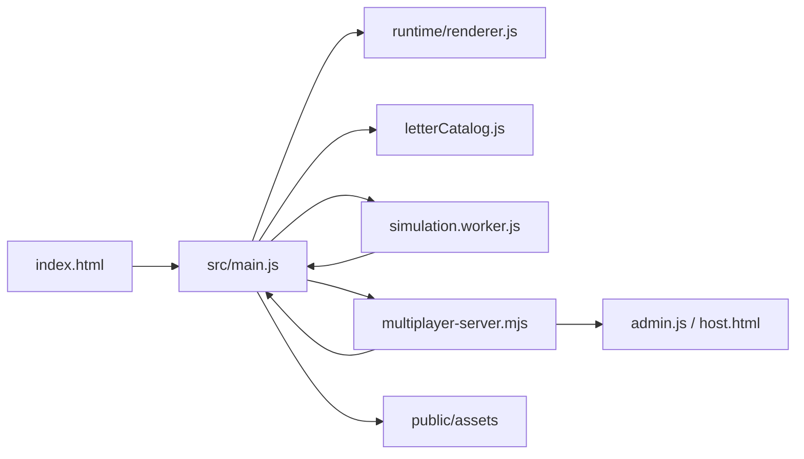
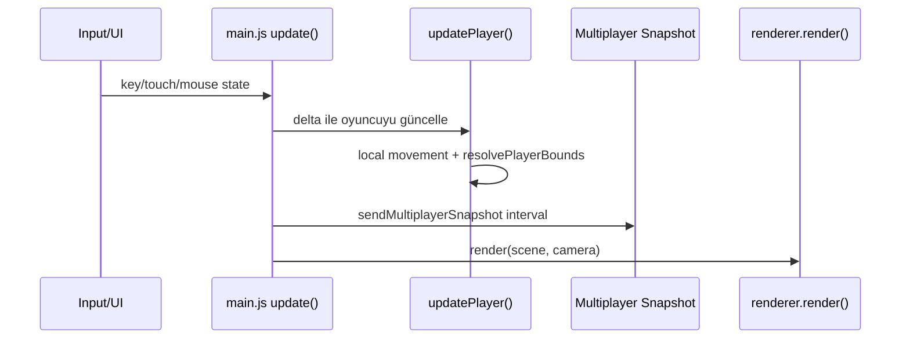

# main.js İnceleme Raporu ve Uygulama Planı

Tarih: 2026-04-30  
Kapsam: `src/main.js`, ilişkili runtime, worker, multiplayer server, Vite ve test yapısı  
Durum notu: İstenen ChatGPT.com / 5.5 Pro extra thinking akışı `browser-use` ile başlatıldı, ancak tarayıcı eklentisi ChatGPT.com navigasyonunda uygulama sunucusu yol hatası verdi. Bu nedenle `main.js` içeriği ChatGPT.com'a gönderilmedi. Aşağıdaki rapor, aynı hedef için Codex'in yerel kod incelemesidir.

## Yönetici Özeti

`src/main.js` bugün oyunun çalışan beyni: render kurulumu, UI state machine, input, mobil kontrol, ses, konuşma sentezi, stage/asset oluşturma, letter card, multiplayer client, remote oyuncu görselleri, test debug API ve oyun döngüsü aynı dosyada duruyor. Bu yapı prototip hızını yüksek tutmuş; ancak artık dosya yaklaşık 8.650 satıra geldiği için değişiklik maliyeti ve yan etki riski büyümüş durumda.

En doğru strateji tam yeniden yazım değil. Önerilen yol, çalışan oyunu koruyarak "strangler refactor" yapmak: önce davranış değiştirmeyen küçük modül çıkarımları, sonra multiplayer ve simulation kararlarının netleştirilmesi, en sonda world/stage ve UI parçalarının ayrılması.

## Kaynak Haritası

Ana dosya ve destek katmanları:

```text
index.html / host.html / admin.html / bot.html
  -> Vite entry points

src/main.js
  -> oyun state'i, DOM, render loop, input, audio, world, multiplayer glue

src/runtime/renderer.js
  -> WebGPU dener, olmazsa WebGLRenderer'a düşer

src/workers/simulation.worker.js
  -> Rapier3D world, character controller, nearest collectible/chest snapshot

src/letterCatalog.js
  -> Arap harfi pedagojik veri modeli, örnekler, formlar, telaffuz verileri

src/network/multiplayerClient.js
  -> ayrı multiplayer client modülü, fakat main.js şu an kendi yerel sınıfını kullanıyor

server/multiplayer-server.mjs
  -> Node HTTP + ws WebSocket lobby/admin server

scripts/sync-public-assets.mjs
  -> public asset allowlist ve GLB/texture hazırlığı
```

## Çalışma Akışı



Bir frame içindeki ana akış:



## Güçlü Taraflar

- `renderer.js` renderer seçimini izole ediyor. WebGPU başarısız olursa WebGL fallback var.
- `simulation.worker.js` ayrı thread kullanıyor. Rapier ana thread'i doğrudan kilitlemiyor.
- Merkezi `dom` haritası, UI elemanlarının nerede kullanıldığını takip etmeyi kolaylaştırıyor.
- Merkezi `state` nesnesi, prototipleme için hızlı ve okunabilir bir global oyun resmi veriyor.
- Multiplayer server hafif ve amaca uygun. REST admin endpointleri ve WebSocket canlı roster ayrımı anlaşılır.
- Test altyapısı pratik debug API'lerle desteklenmiş: `render_game_to_text`, `debug_collect_nearest_letter`, `debug_set_multiplayer_roster`.
- Asset pipeline bilinçli: live asset referansları taranıyor, gereksiz raw obj/mtl payloadları runtime'a taşınmıyor.

## Ana Bulgular

### 1. main.js artık "God module" sınırını geçmiş

Kanıt:

- `src/main.js:712` civarı DOM map başlıyor.
- `src/main.js:1358` civarı devasa `state` başlıyor.
- `src/main.js:3155` runtime ve worker kurulumu var.
- `src/main.js:3436` bootstrap akışı var.
- `src/main.js:6296` event bağlama var.
- `src/main.js:6901` animation loop var.
- `src/main.js:8500` civarı test/debug state çıktısı var.

Risk:

- Küçük bir UI değişikliği multiplayer, audio veya gameplay tarafında yan etki oluşturabilir.
- Dosya içi fonksiyon sırası davranışa bağımlı hale gelmiş.
- Yeni geliştirici için "nereden başlamalıyım?" maliyeti yüksek.

Öneri:

- Önce davranış değiştirmeyen modül çıkarımları yapılmalı.
- `state` tek nesne olarak kalabilir; ama onu kullanan sistemler ayrı dosyalara taşınmalı.

### 2. Multiplayer client iki yerde yaşıyor

Kanıt:

- `src/main.js:80` içinde yerel `class MultiplayerClient` var.
- `src/network/multiplayerClient.js:1` ayrı ve daha gelişmiş görünen bir client modülü var.
- `main.js` bu modülü import etmiyor.

Risk:

- Bug fix bir client'ta yapılıp diğerinde unutulabilir.
- Reconnect, status label, connect timeout, origin çözme gibi davranışlar iki ayrı gerçeklik üretir.

Öneri:

- İlk refactor hedefi bu olmalı.
- `src/network/multiplayerClient.js` tek kaynak haline getirilmeli.
- `main.js` sadece event bağlayan ve state'e yansıtan glue layer olarak kalmalı.

### 3. Rapier worker var, fakat hareket otoritesi net değil

Kanıt:

- Worker kurulumu: `src/main.js:3179`.
- Worker step fonksiyonları: `src/main.js:3260`, `src/main.js:3278`, `src/main.js:3291`.
- Oyuncu hareketinin ana yolu: `src/main.js:7018`.
- Çarpışma çözümü hâlâ yerel AABB: `src/main.js:7130`.

Risk:

- "Fizik worker'da" anlatısı ile gerçek gameplay otoritesi farklılaşabilir.
- Rapier değişikliği yapıldığı sanılıp oyun hareketi etkilenmeyebilir.
- İki collision modeli drift edebilir.

Öneri:

- Karar verilmeli: Worker authoritative movement olacak mı?
- Eğer evet: `updatePlayer` desired translation üretmeli, sonucu worker snapshot belirlemeli.
- Eğer hayır: worker sadece proximity/query helper ise adı ve kapsamı buna göre sadeleştirilmeli.

### 4. UI üretimi ve veri bağlama aynı fonksiyonlarda karışıyor

Kanıt:

- Map card HTML üretimi `buildMapSelectionUI`.
- Character card HTML üretimi `buildCharacterSelectionUi`.
- Letter card render ve speech state `renderLetterCardUi`, `openLetterCard`, `speak...` zincirinde birlikte.
- Skill UI ve touch action UI `buildSkillUi` içinde yoğun şekilde üretiliyor.

Risk:

- Markup değişikliği gameplay state veya input event tarafını bozabilir.
- XSS açısından büyük bir dış risk görünmüyor çünkü veri çoğunlukla statik katalogdan geliyor; ancak HTML string yaklaşımı ileride kullanıcı kaynaklı veri eklenirse tehlikeli hale gelir.

Öneri:

- Önce `src/ui/` altında saf render helper'ları çıkarılmalı.
- Kullanıcı girdisi içeren yerlerde `textContent` tercih edilmeli.

### 5. Debug API çok değerli, ama üretim/debug sınırı belirgin değil

Kanıt:

- `window.render_game_to_text`: `src/main.js:3368`
- `window.debug_set_player_position`: `src/main.js:3378`
- `window.debug_set_multiplayer_roster`: `src/main.js:3392`

Güçlü taraf:

- Playwright testleri bu API sayesinde hızlı ve deterministik.

Risk:

- Public build içinde debug yetenekleri açık kalıyor.
- İleride kötü niyetli kullanım veya demo sırasında yanlış kullanım olabilir.

Öneri:

- Debug API `import.meta.env.DEV || import.meta.env.VITE_ENABLE_DEBUG_API === "1"` gibi bir bayrakla sarılmalı.
- E2E testlerinde bu bayrak açık bırakılmalı.

### 6. Server mimarisi basit ve iyi, ama admin kodu varsayılanı üretim için riskli

Kanıt:

- `server/multiplayer-server.mjs` içinde default admin code: `sun-court-admin`.
- Admin session TTL var.
- CORS varsayılanı `*`.

Risk:

- Local/demo için iyi; public tunnel açıldığında admin endpointleri tahmin edilebilir hale gelir.

Öneri:

- Public/share modunda `MULTIPLAYER_ADMIN_CODE` zorunlu olmalı.
- Admin kodu ekranda veya logda gösterilecekse sadece local ortamda gösterilmeli.

## Öncelikli Plan

### Faz 0: Baseline Koruma

Amaç: Refactor başlamadan çalışan davranışı sabitlemek.

Yapılacaklar:

1. `npm run test:assets:allowlist`
2. `npm run test:server:coalescing`
3. `npm run test:server:50players`
4. `npm run test:e2e:smoke`
5. Manuel smoke: `npm run start:full`, admin panel, QR join, lobby start/reset

Kabul kriteri:

- Tüm mevcut testler geçer.
- `render_game_to_text` baseline çıktısı saklanır.
- Bir refactor PR'ı gameplay davranışı değiştirmez.

### Faz 1: Davranış Değiştirmeyen İlk Çıkarımlar

Amaç: main.js'i kırmadan küçük modüller açmak.

Önerilen sıralama:

1. `src/network/multiplayerClient.js` tek gerçek client yapılsın.
2. Player name/server origin storage helper'ları network modülünden export edilsin.
3. `main.js` içindeki yerel `MultiplayerClient` silinsin.
4. `state.session` ile multiplayer event handler'ları main.js'te kalsın.
5. Aynı testler tekrar koşulsun.

Neden önce multiplayer?

- Zaten ayrı dosya var.
- Yazma kapsamı küçük.
- En net duplication burada.

### Faz 2: Debug ve Test Sınırı

Amaç: Test edilebilirliği korurken public runtime yüzeyini azaltmak.

Yapılacaklar:

1. `src/debug/gameDebugApi.js` oluştur.
2. `renderGameToText` state serializer olarak ayrıştır.
3. Debug API registration fonksiyonu ekle.
4. Registration sadece dev/test bayrağıyla aktif olsun.
5. Playwright config bu bayrağı set etsin.

Kabul kriteri:

- Mevcut E2E testleri aynı fonksiyonları kullanmaya devam eder.
- Public preview'da debug API kapatılabilir.

### Faz 3: Simulation Kararı

Amaç: Worker'ın rolünü netleştirmek.

Seçenek A: Worker authoritative movement

- `updatePlayer` sadece inputtan `desiredTranslation` üretir.
- `queueSimulationStep` her frame veya throttle ile çağrılır.
- Player position worker snapshot'tan uygulanır.
- `resolvePlayerBounds` fallback olarak kalır veya kaldırılır.

Seçenek B: Worker proximity helper

- Dosya ve fonksiyon isimleri bu role göre sadeleştirilir.
- Movement/collision main.js tarafında kalır.
- Rapier dependency'nin gerçekten gerekli olup olmadığı tekrar değerlendirilir.

Öneri:

- Uzun vadede Seçenek A daha tutarlı.
- Kısa vadede Seçenek B daha az riskli.
- Hemen yapılacak karar: belgede ve kod isimlerinde worker'ın mevcut rolü doğru adlandırılmalı.

### Faz 4: UI Modülleri

Amaç: HTML üretimi, state güncelleme ve event bağlama ayrışsın.

Önerilen modüller:

```text
src/ui/mapSelection.js
src/ui/characterSelection.js
src/ui/letterCard.js
src/ui/skillDock.js
src/ui/settingsPanel.js
src/ui/alphabetHud.js
```

Kural:

- UI modülleri DOM node almalı.
- UI modülleri global `state` import etmemeli.
- Data ve callback dışarıdan verilmeli.

### Faz 5: World ve Asset Builder Ayrımı

Amaç: Stage üretimi ve asset template yerleşimi gameplay loop'tan ayrışsın.

Önerilen modüller:

```text
src/world/stages.js
src/world/sunCourt.js
src/world/halloweenHollows.js
src/world/hexagonVillage.js
src/world/templates.js
src/world/collectibles.js
src/world/chests.js
```

Kabul kriteri:

- `buildWorldStage(stageKey)` main.js'te kalabilir ama sadece orkestrasyon yapar.
- Stage modülleri `worldGroup`, `state.world`, template katalog ve texture girdileriyle çalışır.

### Faz 6: Audio ve Speech Ayrımı

Amaç: Web Audio ve Speech Synthesis kodunu gameplay dosyasından çıkarmak.

Önerilen modüller:

```text
src/audio/audioEngine.js
src/audio/speech.js
```

Kabul kriteri:

- `playCollectibleSound`, `playSkillSound`, `speakLetterCardPronunciation` gibi fonksiyonlar API olarak kalır.
- `main.js` sadece olay olduğunda audio API'yi çağırır.

## Dalga Bazlı Uygulama

### Wave 1: Güvenli Extraction

- Multiplayer client tekilleştirme
- Debug API gate
- Pure storage/helper extraction
- Baseline testler

Risk: Düşük  
Beklenen kazanım: Dosya küçülür, duplicate client riski kapanır.

### Wave 2: Sistem Sınırları

- UI helper modülleri
- Audio/speech modülleri
- Settings persistence modülü

Risk: Orta  
Beklenen kazanım: UI değişiklikleri gameplay koduna daha az dokunur.

### Wave 3: Runtime Mimari Kararı

- Simulation worker rolü netleşir.
- Stage/world builder ayrışır.
- Multiplayer snapshot schema testleri eklenir.

Risk: Orta-yüksek  
Beklenen kazanım: Oyun loop'u daha anlaşılır ve sürdürülebilir olur.

## Ne Yapılmamalı?

- Tek PR'da tüm `main.js` parçalanmamalı.
- React/Vue gibi framework eklenmemeli; mevcut proje vanilla JS ve game loop mantığıyla uyumlu.
- Gameplay davranışı ile mimari refactor aynı committe karışmamalı.
- Önce TypeScript'e geçme denenmemeli; sınırlar netleşmeden migration maliyeti büyür.
- Worker'ı "var diye" ana otorite yapmaya çalışmamalı; önce test ve davranış beklentisi yazılmalı.

## Neden Böyle?

Bu proje klasik web uygulaması değil; gerçek zamanlı oyun runtime'ı. Bu yüzden en değerli şey çalışan frame loop'u, input tepkisi, asset yükleme ve multiplayer senkronunun bozulmaması. Refactor planı dosya sayısını artırmak için değil, değişiklik güvenini artırmak için yapılmalı.

Öncelik sırası bu nedenle şöyle:

1. Çalışanı ölç.
2. Duplicate gerçeklikleri tekilleştir.
3. Debug/test kancasını koru.
4. UI ve audio gibi yan sistemleri ayır.
5. En riskli karar olan physics authority konusunu testle ele al.

## Önerilen İlk Commit

Başlık:

```text
refactor: use shared multiplayer client in main runtime
```

İçerik:

- `main.js` içindeki yerel `MultiplayerClient` kaldırılır.
- `src/network/multiplayerClient.js` import edilir.
- Event isimleri ve payload uyumu korunur.
- `npm run test:server:coalescing`
- `npm run test:server:50players`
- `npm run test:e2e:smoke`

Rollback kolaylığı:

- Tek sorumluluk: multiplayer client kaynak tekilleştirme.
- UI, world, audio, physics koduna dokunulmaz.

## Sonuç

`main.js` şu an kötü yazılmış bir dosya değil; görevini fazla iyi yapmış ve büyümüş bir prototip çekirdeği. Asıl risk "monolit var" değil, aynı anda çok fazla kararın aynı dosyada yaşaması. En iyi iyileştirme, oyunu dondurmadan küçük ve doğrulanabilir parçalar halinde sınırları belirlemek.

İlk teknik hedef net: multiplayer client duplication kapatılmalı. İkinci hedef debug API sınırlandırılmalı. Üçüncü hedef ise simulation worker'ın gerçek rolünü karara bağlamak olmalı.
